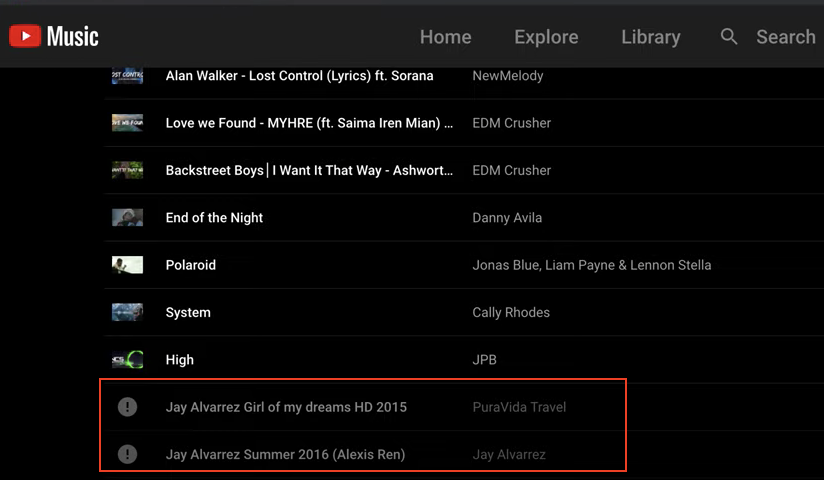

[Versión en Español](leeme.md)

  

  <a href="#install-the-app">Install the app</a>
  &nbsp;&nbsp;&nbsp;|&nbsp;&nbsp;&nbsp;
  <a href="#add-youtube-playlists">Add YouTube playlists</a>
  &nbsp;&nbsp;&nbsp;|&nbsp;&nbsp;&nbsp;
  <a href="#extract-some-minutes-from-the-song">Extract some minutes from the song</a>
  &nbsp;&nbsp;&nbsp;|&nbsp;&nbsp;&nbsp;
  <a href="#downloads">Downloads</a>
  &nbsp;&nbsp;&nbsp;|&nbsp;&nbsp;&nbsp;
  <a href="#share-your-playlists-and-songs">Share your playlists and songs</a>
  &nbsp;&nbsp;&nbsp;|&nbsp;&nbsp;&nbsp;
  <a href="#motivation">Motivation</a>
  &nbsp;&nbsp;&nbsp;|&nbsp;&nbsp;&nbsp;
  <a href="#platform">Platform</a>
  &nbsp;&nbsp;&nbsp;|&nbsp;&nbsp;&nbsp;
  <a href="#support-or-contact">Support or contact</a>

 

[YouMusic](https://youmusic.app) helps you to keep track of your YouTube playlists. 

Maybe you have many playlists in your YouTube account for different topics. YouMusic allows you to bring YouTube playlists where you have your favorite songs, talks, podcast, etc. Then you will be able to play just the audio of them. You can also download any song or the whole playlist.

When a video is added or removed in the original playlist (YouTube), you will see what are the changes. Then you can sync your playlist or edit it manually.

You can change the name of the songs, so when you download a song, the name won't contain _"(Official video)"_ or _"(with lyrics)"_.

If any song is deleted from YouTube you will see that the song is not in the original playlist anymore, but you can search it again as you know exactly which one is gone.

[YouMusic](https://youmusic.app) is a Web Application that you can use in the browser or as regular app in your Smartphone.

 

## Install the app
_YouMusic is not in Google Play Store or Apple Store_

[https://youmusic.app](https://youmusic.app)

### Desktop

### Iphone

### Android

 

## Add YouTube playlists

**_The playlist has to be Public or Unlisted_**

### Edit the playlist

### Playlists (auto-sync)

 

## Extract some minutes from the song
Watch the [video](https://youtu.be/xWxEDVjj5b8)

 

## Downloads

 

## Share your playlists and songs

 

## Motivation

When YouTube deletes a video you can't know which one is gone in your playlist

  

  

 

You can't listen to all the songs in your playlists in YouTubeMusic

  

  

 

## Platform
### Architecture

  

 

### Infrastructure

  

 

## Support or contact

Having trouble with the app? Send us an email to **_youmusicpwa@gmail.com_** and we’ll help you sort it out.

_This [documentation](https://youmusic.app/doc)_
