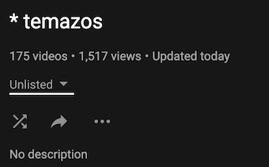
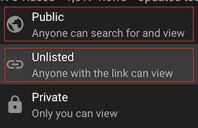

[YouMusic](https://youmusic.app) te ayuda a saber que cambios ha habido en de tus playlists de YouTube. 

Es posible que tengas muchas playlists en YouTube sobre diferentes temas. YouMusic te permite importar playlists de YouTube de tus canciones favoritas, charlas, podcast, etc. Podrás escuchar el audio de esas playlists y descargarlas.

Cuando se añaden o eliminan videos a la playlist original (YouTube), verás exactamente que canciones han sido añadias o eliminadas, y podrás sincronizar tus listas de forma manual, editandola, o automaticamente.

Puedes cambiar el nombre de las canciones, para que a la hora de descargarlas no contengan _"(Official video)"_ o _"(with lyrics)"_.

Si alguna canción se elimina en YouTube, podrás saber cual ha sido y por tanto poder buscarla de nuevo.

[YouMusic](https://youmusic.app) es una Aplicación Web que puedes usar en el navegador o como una Aplicación normal en tu Smartphone.

## Instala la app

### PC

### Iphone

### Android
(pending)

## Añade playlists de YouTube

**_Las playlist tienen que ser Public o Unlisted_**

### Edita la playlist

### Playlists (auto-sync)

## Extrae un trozo de un video
Mira el [video](https://youtu.be/xWxEDVjj5b8)

## Comparte tus playlists y canciones

## Soporte o Contacto

¿Problemas con la app? Envia un email a **_youmusicpwa@gmail.com_**.

